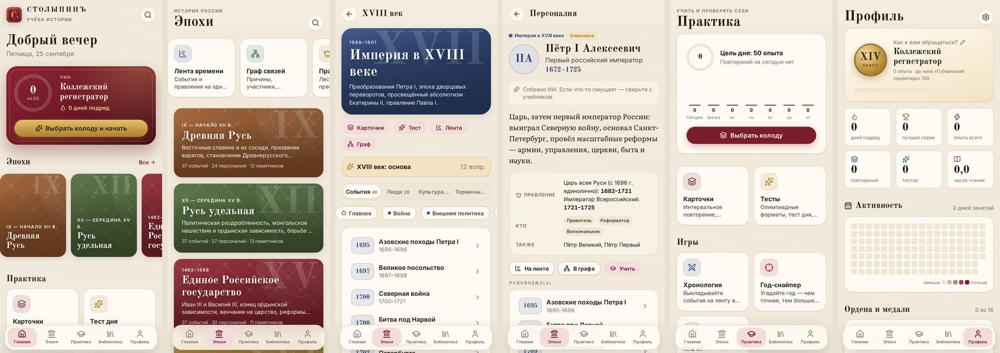
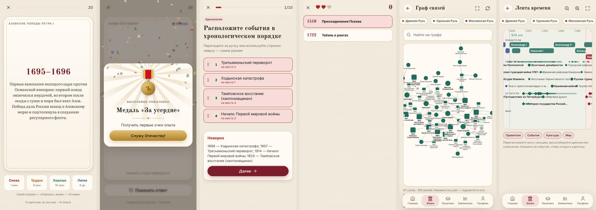
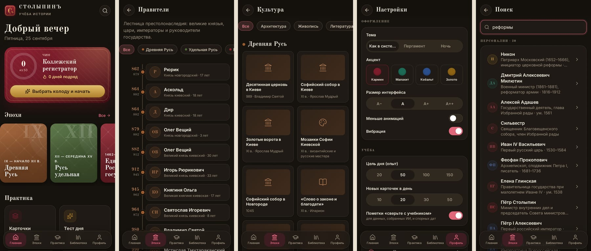
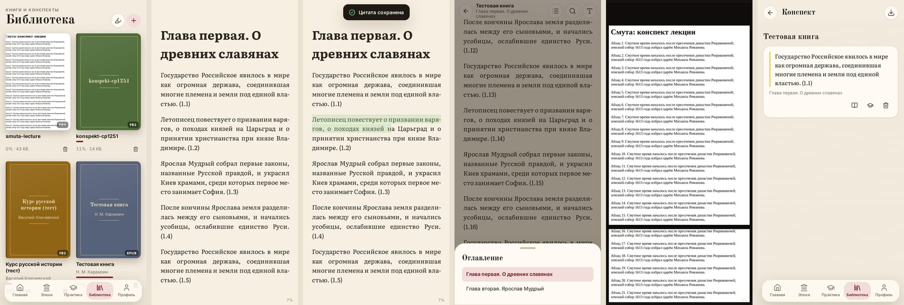
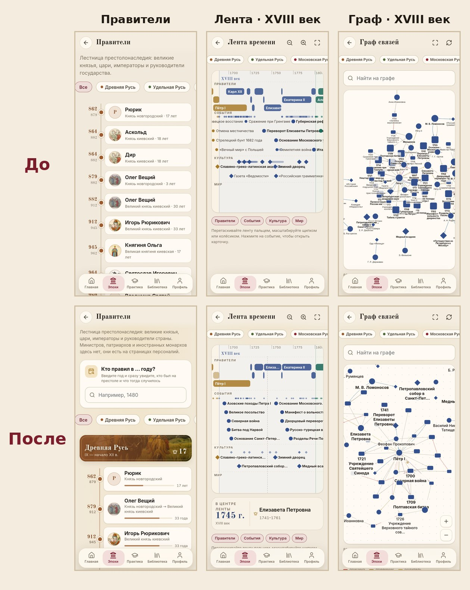

# СТОЛЫПИНЪ — учёба истории

Офлайн-приложение для Android, чтобы готовиться к олимпиадам по истории России (ВсОШ и перечневые олимпиады).
Всё работает без интернета: база знаний встроена в приложение, прогресс хранится только на телефоне.



## Установка на телефон

1. Скачайте APK из раздела **Releases** (последняя версия). Сборки веток и PR лежат во вкладке **Actions** →
   запуск **Android APK** → артефакт `stolypin-apk`.
2. Скачайте `.apk` на телефон и откройте его. Android попросит разрешить установку из этого источника.
3. Новые версии устанавливаются поверх старых: все сборки подписаны одним ключом
   (`android/keystores/README.md`), прогресс сохраняется.

## Что умеет

- **Эпохи** — 11 периодов от Древней Руси до наших дней: события, персоналии, памятники культуры,
  термины и связи между ними. Лестница правителей, словарь, галерея культуры.
- **Лента времени** — синхронная шкала с масштабированием: правления, события, культура и мировые события.
- **Граф связей** — причины и следствия, участники, преемники, союзники и противники.
- **Карточки** — интервальное повторение по алгоритму FSRS, как в Anki. Режимы «Заучивание»,
  «Письмо» и «Подбор», как в Quizlet. Свои колоды и импорт из Quizlet или Anki (текстом).
- **Тесты** — 8 олимпиадных форматов: один или несколько ответов, хронология, соответствие, точная дата,
  термин, «угадай по подсказкам», «найди ошибки в тексте». Есть «Тест дня», конструктор, режим экзамена
  и «Работа над ошибками».
- **Игры** — «Хронология» (выложить события по порядку), «Год-снайпер», «Кто я?».
- **Библиотека** — читалка EPUB, FB2, MOBI/AZW3, PDF, CBZ и TXT: темы, шрифты, оглавление, поиск,
  цветные выделения, закладки. Из выделенного текста можно сделать карточку, выделения собираются в конспект.
- **Профиль** — опыт и чины по Табели о рангах, ордена за достижения, серия дней, календарь активности,
  резервная копия.

⚠️ Базовый пакет «Основа» собран с помощью ИИ и выборочно проверен. Спорные места помечены, но сверяйте
факты с учебником.









## Материалы

Контент добавляется данными, без изменения кода: `content/packs/<пакет>/`. Формат описан в
[`docs/content-format.md`](docs/content-format.md), порядок работы для агентов — в
[`.agents/skills/add-content/SKILL.md`](.agents/skills/add-content/SKILL.md).

```bash
pnpm content:new lekcii-mgu "Лекции МГУ"   # новый пакет
pnpm content:check                          # проверка всего корпуса
pnpm content:bundle lekcii-mgu              # файл для импорта прямо в приложении
```

## Разработка

```bash
pnpm install
pnpm dev          # http://localhost:5173
pnpm check        # типы + контент
pnpm build
pnpm android:apk  # нужны JDK 21 и Android SDK 36; APK: android/app/build/outputs/apk/release/
```

Стек: Svelte 5, TypeScript, Vite, Capacitor 8, Dexie (IndexedDB), ts-fsrs, Cytoscape.js,
foliate-js, PDF.js, MiniSearch, Zod. Архитектура: [`docs/architecture.md`](docs/architecture.md).
